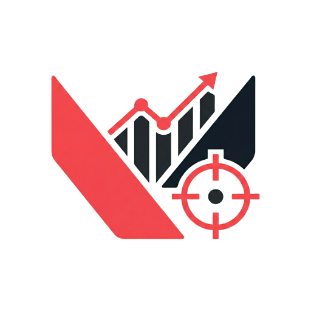
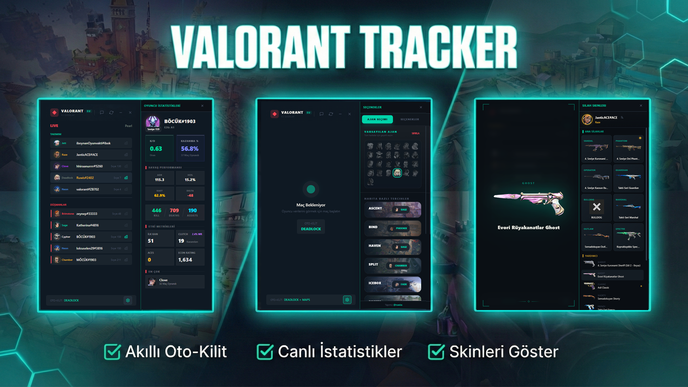
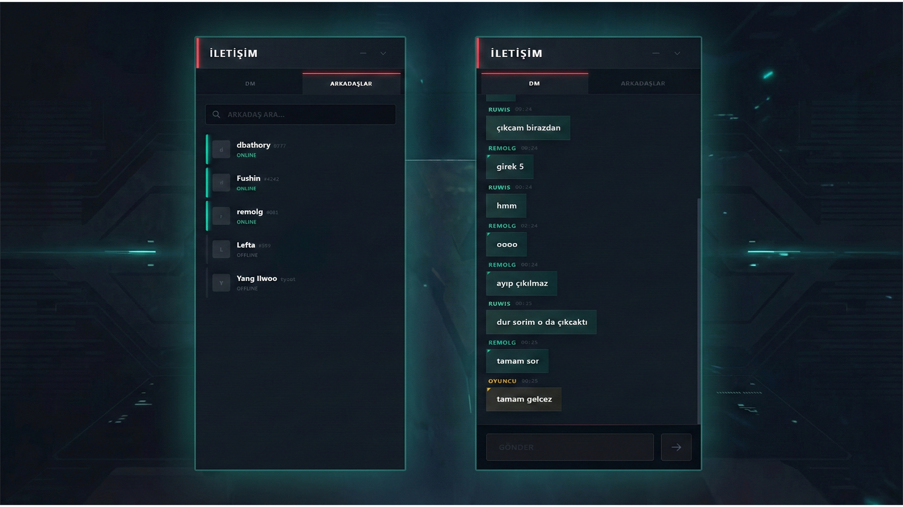

#  VALORANT TRACKER

  

---

**VALORANT TRACKER**, VALORANT deneyiminizi geliştirmek için tasarlanmış güçlü, hafif ve modern bir masaüstü uygulamasıdır. Performans ve estetik ön planda tutularak geliştirilen uygulama; gerçek zamanlı veriler, otomasyonlar ve sosyal özellikleri doğrudan masaüstünüze getirir.

## Temel Özellikler

### Gelişmiş Analiz
- **Silah Skin Görüntüleyici**: Maçtaki diğer oyuncuların hangi silah kaplamalarını (skin) kullandığını anında görün.
- **Takım Arkadaşı Geçmişi**: Oyuncuların son 2 maçına dayanarak kimlerle sık oynadığını (premade) tespit edin.
- **Tracker.gg Entegrasyonu**: Detaylı oyuncu profili istatistiklerine ve performans geçmişine hızlı erişim sağlayın.

### Otomasyon ve Araçlar
- **Harita Bazlı Otomatik Kilitleme (Instalock)**: Seçilen haritaya göre favori ajanınızı maç başlar başlamaz otomatik olarak kilitleyin.
- **Yabancı Dil İsim Çevirisi**: Daha iyi iletişim için yabancı dildeki isimleri gerçek zamanlı olarak çevirin.
- **Oyun İçi Arayüz (Overlay)**: Seçim ekranında ve maç sırasında istatistikleri gösteren kesintisiz paneller.
- **Özel Tuş Ataması (Hotkeys)**: Uygulama arayüzünü oyun içindeyken tek bir tuşla anında ekrana getirin veya gizleyin.

### İletişim
- **Hızlı Mesajlaşma (DM)**: Uygulamadan çıkmadan arkadaşlarınızla hızlıca mesajlaşın.
- **Mesaj Geçmişi**: Arkadaşlarınızla olan tüm yazışmalarınızın geçmişini tek bir yerden takip edin.

### Fiyatlandırma ve Satın Alım

- **Fiyat**: 250₺
- **Deneme**: 1 günlük ücretsiz deneme süresi için lütfen iletişime geçin.

### İletişim

Sorularınız veya satın alım işlemleri için aşağıdaki kanallardan ulaşabilirsiniz:

| Platform | Bilgi / Link |
| :--- | :--- |
| **Telegram** | [@omergundgr](https://t.me/omergundgr) |
| **Discord** | `ruwis.db` |
| **R10.net** | [omergundogar](https://www.r10.net/profil/118273-omergundogar.html) |
| **E-posta** | [hqnetcontact@gmail.com](mailto:hqnetcontact@gmail.com) |

  

