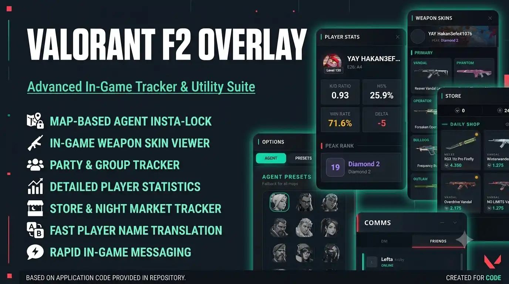

# VALORANT Tracker

  

Lightweight desktop companion for VALORANT. Real-time match data, automation, and social tools in a modern Tauri app.

## Features

- **Map-based agent instalock** — lock your preferred agent instantly per map
- **Weapon skin viewer** — see what skins other players are using in the match
- **Premade / party detection** — see who a player is queued with
- **Player statistics** — quick access to performance and profile stats
- **Night Market & store** — browse the daily shop and Night Market offers
- **Fast name translation** — translate foreign player names in real time
- **Quick messaging** — chat with friends without leaving the app
- **Game settings presets** — save and restore game settings profiles

## Contact

| Platform | Link |
| :--- | :--- |
| **Telegram** | [@omergundgr](https://t.me/omergundgr) |
| **Discord** | `ruwis.db` |
| **R10.net** | [omergundogar](https://www.r10.net/profil/118273-omergundogar.html) |
| **Email** | [hqnetcontact@gmail.com](mailto:hqnetcontact@gmail.com) |

## License

See [LICENSE](LICENSE).
